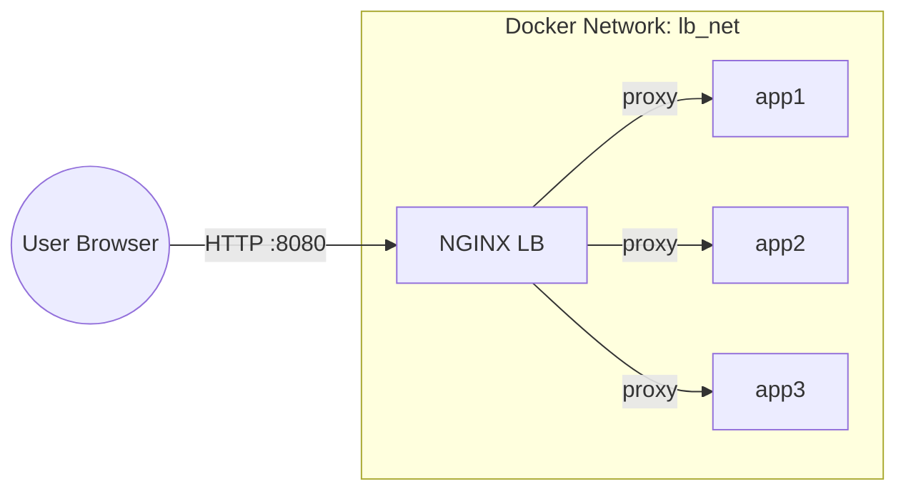

# AnsibleNginxLB - NGINX Load Balancer Simulation

## 🎯 Objectives
- **Local LB Simulation:** Pool of Python app containers behind a single NGINX reverse proxy
- **IaC with Docker Compose:** Define everything in `docker-compose.yml`
- **Config Mgmt:** Use Ansible to push and reload NGINX configs
- **CI/CD:** GitHub Actions workflow to spin up/down Compose and run Ansible on merges

## 🛠️ Tech Stack
- Docker Engine & Docker Compose
- Ansible (playbooks + inventory)
- GitHub Actions (CI/CD)
- NGINX (software LB)
- Python HTTP apps as backend targets

---

## 🚀 Quick Start

### Prerequisites
- [Docker Desktop](https://www.docker.com/products/docker-desktop/)
- [Docker Compose](https://docs.docker.com/compose/install/)
- [Ansible](https://docs.ansible.com/ansible/latest/installation_guide/intro_installation.html)

### 1. Clone & Build
```bash
git clone https://github.com/Samirrahman71/AnsibleNginxLB.git
cd AnsibleNginxLB
```

### 2. Start the stack
```bash
docker-compose up -d --build
```

### 3. Configure NGINX with Ansible
```bash
ansible-playbook -i ansible/inventory/hosts ansible/lb.yml
```

### 4. Test Load Balancing
- Visit [http://localhost:8080](http://localhost:8080) in your browser.
- Refresh to see responses from all 3 app containers.

### 5. Tear Down
```bash
docker-compose down
```

---

## 🗺️ Architecture Diagram


---

## ✅ Project Components
- `docker-compose.yml` - Container orchestration
- `ansible/` folder - Playbooks and NGINX configuration templates
- `.github/workflows/ci.yml` - GitHub Actions CI/CD pipeline
- `app/` - Python application backend

