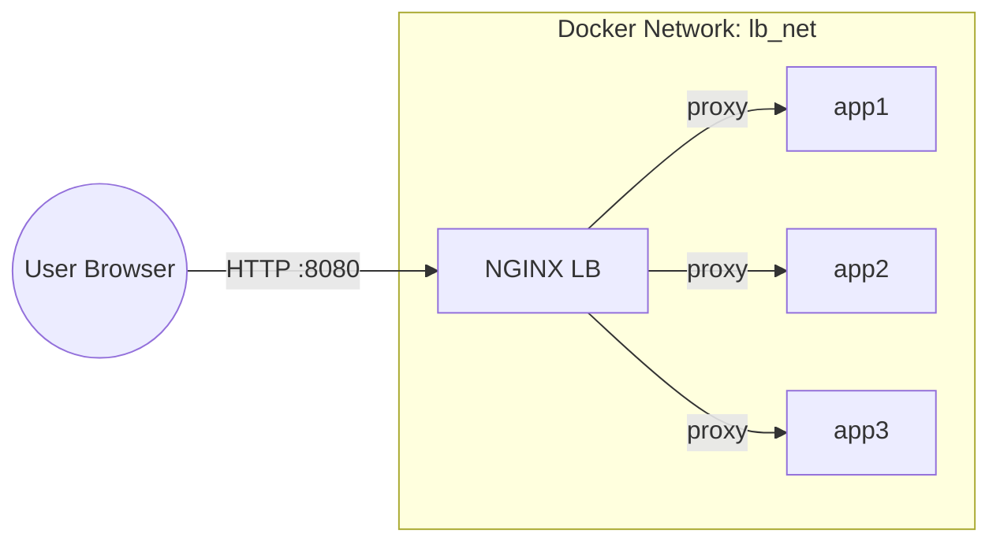

# AnsibleNginxLB - NGINX Load Balancer Simulation

## 🎓 Educational Load Balancer Demo

This project provides both a functional NGINX load balancer implementation AND an educational interactive web application that explains load balancing concepts in a user-friendly way. It's perfect for learning how load balancers work through a hands-on experience.


### Interactive Features

- **Live Load Balancing:** See your requests distributed across multiple backend servers in real-time
- **Multiple Load Balancing Algorithms:** Choose between Round Robin, Least Connections, and IP Hash methods
- **Color-Coded Servers:** Each backend server has a unique color to visually track the load balancing
- **Hit Counter Visualization:** Shows the distribution of traffic across servers
- **Health Check API:** `/health` endpoint returns server status in JSON format
- **Interactive Educational UI:** Learn how load balancing works through visual explanations

## 🎯 Objectives
- **Local LB Simulation:** Pool of Python app containers behind a single NGINX reverse proxy
- **Educational UI:** Interactive visualization of load balancing concepts
- **IaC with Docker Compose:** Define everything in `docker-compose.yml`
- **Config Mgmt:** Use Ansible to push and reload NGINX configs
- **CI/CD:** GitHub Actions workflow for automated testing and deployment

## 🛠️ Tech Stack
- Docker Engine & Docker Compose
- Ansible (playbooks + inventory)
- NGINX (software load balancer)
- Python (backend servers)
- HTML, CSS, JavaScript (interactive UI)

---

## 🚀 Quick Start

### Prerequisites
- [Docker Desktop](https://www.docker.com/products/docker-desktop/)
- [Docker Compose](https://docs.docker.com/compose/install/)
- [Ansible](https://docs.ansible.com/ansible/latest/installation_guide/intro_installation.html)

### 1. Clone & Build
```bash
git clone https://github.com/Samirrahman71/AnsibleNginxLB.git
cd AnsibleNginxLB
```

### 2. Start the stack
```bash
docker-compose up -d --build
```

### 3. Configure NGINX with Ansible (optional)
```bash
# Use default Round Robin method
ansible-playbook -i ansible/inventory/hosts ansible/lb.yml

# Or specify a different load balancing method:
ansible-playbook -i ansible/inventory/hosts ansible/lb.yml -e "lb_method=least-connections"
ansible-playbook -i ansible/inventory/hosts ansible/lb.yml -e "lb_method=ip-hash"
```

### 4. Explore the Load Balancer Demo
- Visit [http://localhost:8080](http://localhost:8080) in your browser
- **Try this:** Refresh the page multiple times to see the load balancer distribute your requests across different backend servers (notice the color change at the top)
- Experiment with different load balancing methods using the method selector
- Use the interactive visualizations to understand how load balancing works
- Check the hit counter to see the distribution of your requests

### 5. Educational Demo Website
We've created a dedicated website that explains load balancing concepts in simple terms:
- **Official Demo Website**: [https://sites.google.com/sjsu.edu/ansiblengnixlb/home](https://sites.google.com/sjsu.edu/ansiblengnixlb/home)
- Perfect for sharing with colleagues who are new to load balancing
- Explains core concepts with everyday analogies
- Provides visual demonstrations of load balancing in action

### 6. API Endpoints
- Health Check: [http://localhost:8080/health](http://localhost:8080/health)
- LB Method Status: [http://localhost:8080/lb-status](http://localhost:8080/lb-status)

### 7. Tear Down
```bash
docker-compose down
```

---

## 🗺️ Architecture Diagram


---

## 📋 Project Components

### Infrastructure
- `docker-compose.yml` - Container orchestration for NGINX and app servers
- `ansible/` - Playbooks and Jinja2 templates for NGINX configuration
- `.github/workflows/ci.yml` - GitHub Actions CI/CD pipeline

### Application
- `app/app.py` - Python web server with health checks and HTML templating
- `app/templates/` - HTML templates with educational content
- `app/static/` - CSS, JavaScript, and other static assets
- `app/Dockerfile` - Container definition for the backend servers

### Key Features
- **Multiple Load Balancing Algorithms:**
  - **Round-Robin:** Requests are distributed evenly in sequential order
  - **Least Connections:** Traffic is sent to the server with fewest active connections
  - **IP Hash:** Provides session persistence by routing users from the same IP to the same server
- **Interactive Visualization:** See the load balancer in action
- **Educational Content:** Learn about load balancing through simple explanations
- **API Health Checks:** Monitor the status of backend services
- **Traffic Distribution Metrics:** Track how traffic is distributed
- **Educational Demo Website:** Simple explanations with relatable examples at [sites.google.com/sjsu.edu/ansiblengnixlb](https://sites.google.com/sjsu.edu/ansiblengnixlb/home)

## 📊 Technical Details

### NGINX Load Balancer Configuration

#### Round Robin (Default)
```nginx
upstream backend {
    # Default: requests distributed sequentially
    server app1:8000;
    server app2:8000;
    server app3:8000;
}

server {
    listen 80;
    location / {
        proxy_pass http://backend;
    }
}
```

#### Least Connections
```nginx
upstream backend {
    least_conn; # Send to server with fewest active connections
    server app1:8000;
    server app2:8000;
    server app3:8000;
}
```

#### IP Hash (Session Persistence)
```nginx
upstream backend {
    ip_hash; # Consistent routing based on client IP
    server app1:8000;
    server app2:8000;
    server app3:8000;
}
```

### Benefits for SREs and DevOps
- **High Availability:** Demonstrates how to build resilient systems
- **Scalability:** Shows horizontal scaling with multiple backend instances
- **Monitoring:** Includes health checks and traffic visualization
- **Infrastructure as Code:** Everything defined in Docker Compose and Ansible
- **CI/CD Integration:** GitHub Actions workflow for automated deployment

