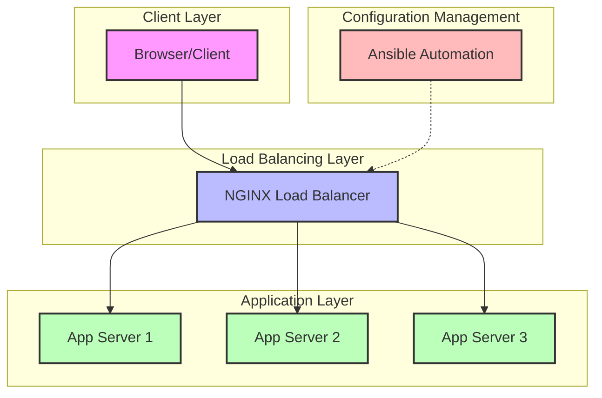

# AnsibleNginxLB

[](https://www.docker.com/)
[](https://nginx.org/)
[](https://www.ansible.com/)
[](https://www.python.org/)
[](LICENSE)

> Production-grade load balancer simulation with advanced distribution algorithms and observability

This project provides a complete load balancing environment featuring multiple distribution algorithms, visualization tools, and real-time metrics. It demonstrates industry-standard patterns for high-availability architectures through a hands-on learning environment.

<p align="center">
  
</p>

## 🚀 Quick Start

```bash
# Clone the repository
git clone https://github.com/Samirrahman71/AnsibleNginxLB.git
cd AnsibleNginxLB

# Start the environment
docker-compose up -d --build

# Access the demo
open http://localhost:8080
```

## ✨ Features


- **Advanced Load Balancing Algorithms:**
  - `Round Robin`: Sequential distribution with predictable, even traffic patterns
  - `Least Connections`: Dynamic distribution based on server load and connection counts
  - `IP Hash`: Session persistence with consistent hashing for user-to-server affinity

- **Real-time Metrics & Observability:**
  - Server-specific request counters with distribution visualization
  - Color-coded server identification for pattern recognition
  - Request timestamp and latency tracking
  - Server uptime monitoring

- **API-First Design:**
  - RESTful health check endpoints (`/health`)
  - Load balancer status endpoint (`/lb-status`)
  - JSON-formatted responses for programmatic consumption

- **Infrastructure as Code:**
  - Docker Compose for container orchestration
  - Ansible playbooks for configuration management
  - Template-driven NGINX configuration

## 🏗️ Architecture



## 🛠️ Technology Stack

| Component | Technology | Purpose |
|-----------|------------|----------|
| **Load Balancer** | NGINX | High-performance reverse proxy with configurable load balancing |
| **Application Servers** | Python HTTP.server | Lightweight backend servers for request handling |
| **Container Orchestration** | Docker & Docker Compose | Service definition and isolation |
| **Configuration Management** | Ansible | Automation of NGINX configuration deployment |
| **Continuous Integration** | GitHub Actions | Automated testing and deployment workflow |
| **Frontend** | HTML5, CSS3, JavaScript | Interactive UI for visualization and education |

## 📋 Installation & Usage

### Prerequisites

- Docker Engine 20.10+ and Docker Compose v2
- Ansible 2.9+ (optional, for configuration management)
- Any modern web browser

### Deployment

1. **Clone the repository**
   ```bash
   git clone https://github.com/Samirrahman71/AnsibleNginxLB.git && cd AnsibleNginxLB
   ```

2. **Launch the environment**
   ```bash
   docker-compose up -d --build
   ```

3. **Access the interactive demo**
   - Open [http://localhost:8080](http://localhost:8080) in your browser
   - Refresh multiple times to observe load distribution

### Advanced Configuration

Configure different load balancing algorithms with Ansible:

```bash
# Round Robin (default)
ansible-playbook -i ansible/inventory/hosts ansible/lb.yml

# Least Connections
ansible-playbook -i ansible/inventory/hosts ansible/lb.yml -e "lb_method=least-connections"

# IP Hash (sticky sessions)
ansible-playbook -i ansible/inventory/hosts ansible/lb.yml -e "lb_method=ip-hash"
```

### API Reference

| Endpoint | Method | Description | Example Response |
|----------|--------|-------------|------------------|
| `/health` | GET | Server health status | `{"status":"healthy","server":"app1","uptime":3600,"requests":42}` |
| `/lb-status` | GET | Load balancer configuration | `{"method":"round-robin","description":"Distributes requests sequentially"}` |

### Educational Resources

Visit our [interactive demo website](https://sites.google.com/sjsu.edu/ansiblengnixlb/home) for visual explanations and learning materials.

### Cleanup

```bash
docker-compose down   # Remove containers only
docker-compose down -v  # Remove containers and volumes
```

## 💻 Implementation Details

### Project Structure

```plaintext
AnsibleNginxLB/
├── ansible/                 # Configuration management
│   ├── inventory/           # Target host definitions
│   ├── templates/           # NGINX configuration templates
│   │   ├── nginx-round-robin.conf.j2  # Round Robin algorithm
│   │   ├── nginx-least-conn.conf.j2   # Least Connections algorithm
│   │   └── nginx-ip-hash.conf.j2      # IP Hash algorithm
│   └── lb.yml               # Playbook for load balancer configuration
├── app/                     # Backend application servers
│   ├── static/              # CSS, JavaScript resources
│   ├── templates/           # HTML templates with interactive UI
│   ├── app.py               # Python HTTP server implementation
│   └── Dockerfile           # Container definition
├── docs/                    # Documentation and assets
├── nginx/                   # Default NGINX configuration
├── .github/workflows/       # CI/CD pipeline definitions
└── docker-compose.yml       # Service orchestration
```

### Load Balancing Implementation

This project demonstrates three industry-standard load balancing algorithms:

#### 1. Round Robin (Default)

Sequentially distributes requests across all servers in circular order.

```nginx
upstream backend {
    # Round Robin - sequential distribution
    server app1:8000;
    server app2:8000;
    server app3:8000;
}
```

**Best for**: Evenly distributed workloads where requests have similar processing requirements.

#### 2. Least Connections

Dynamically routes traffic to the server with the fewest active connections.

```nginx
upstream backend {
    least_conn;  # Connection-aware distribution
    server app1:8000;
    server app2:8000;
    server app3:8000;
}
```

**Best for**: Workloads with varying request processing times or heterogeneous server capacities.

#### 3. IP Hash

Consistently routes clients to the same backend server based on client IP address.

```nginx
upstream backend {
    ip_hash;  # Client-based affinity
    server app1:8000;
    server app2:8000;
    server app3:8000;
}
```

**Best for**: Applications requiring session persistence where client state must be maintained.

## 🧪 Performance Comparison

Each load balancing algorithm offers different performance characteristics for various scenarios:

| Algorithm | Throughput | Session Persistence | Load Distribution | Memory Usage |
|-----------|-----------|---------------------|------------------|-------------|
| **Round Robin** | ⭐⭐⭐⭐⭐ | ❌ None | Even, predictable | Lowest |
| **Least Connections** | ⭐⭐⭐⭐ | ❌ None | Dynamic, adaptive | Medium |
| **IP Hash** | ⭐⭐⭐ | ✅ IP-based | Potentially uneven | Higher |

## 🔧 Advanced Configuration

### Fine-tuning NGINX Parameters

In production environments, consider these performance optimizations:

```nginx
http {
    # Connection handling optimization
    keepalive_timeout 65;  # Persistent connection timeout
    keepalive_requests 100;  # Requests per connection
    
    # Worker tuning
    worker_processes auto;  # Auto-scale to CPU cores
    worker_connections 1024;  # Connections per worker
    
    # Buffer settings
    client_body_buffer_size 10K;
    client_header_buffer_size 1k;
    client_max_body_size 8m;
    large_client_header_buffers 4 4k;
    
    # Timeouts
    client_body_timeout 12;
    client_header_timeout 12;
    send_timeout 10;
    
    # Upstream timeout handling
    proxy_connect_timeout 90;
    proxy_send_timeout 90;
    proxy_read_timeout 90;
    proxy_buffer_size 4k;
    proxy_buffers 4 32k;
    proxy_busy_buffers_size 64k;
    proxy_temp_file_write_size 64k;
}
```

## 🔄 Scaling and High Availability

This architecture can be extended for production use by:

1. **Multiple NGINX Instances**: Add keepalived for failover between multiple NGINX nodes
2. **Dynamic Backend Registration**: Integrate service discovery (Consul/etcd)
3. **Advanced Health Checks**: Implement active and passive health monitoring
4. **Metrics Integration**: Add Prometheus exporters for real-time monitoring
5. **SSL Termination**: Configure with Let's Encrypt for TLS


## 👥 Contributing

Contributions are welcome! Please feel free to submit a Pull Request.

1. Fork the repository
2. Create your feature branch (`git checkout -b feature/amazing-feature`)
3. Commit your changes (`git commit -m 'Add some amazing feature'`)
4. Push to the branch (`git push origin feature/amazing-feature`)
5. Open a Pull Request

## 📜 License

This project is licensed under the MIT License - see the LICENSE file for details.

## 🙏 Acknowledgments

- NGINX for their excellent load balancing technology
- Docker for container orchestration capabilities
- Ansible for configuration management automation

---

<p align="center">
  <a href="https://sites.google.com/sjsu.edu/ansiblengnixlb/home">Official Demo Website</a> •
  <a href="https://github.com/Samirrahman71/AnsibleNginxLB/issues">Report Bug</a> •
  <a href="https://github.com/Samirrahman71/AnsibleNginxLB/pulls">Request Feature</a>
</p>
